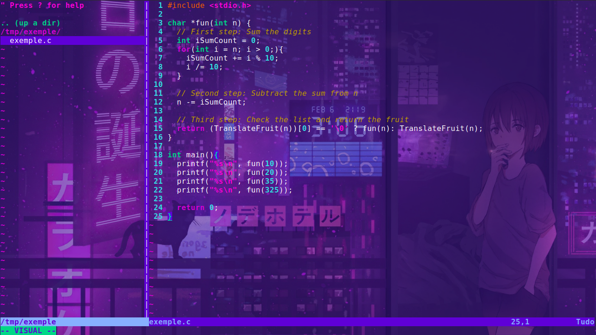
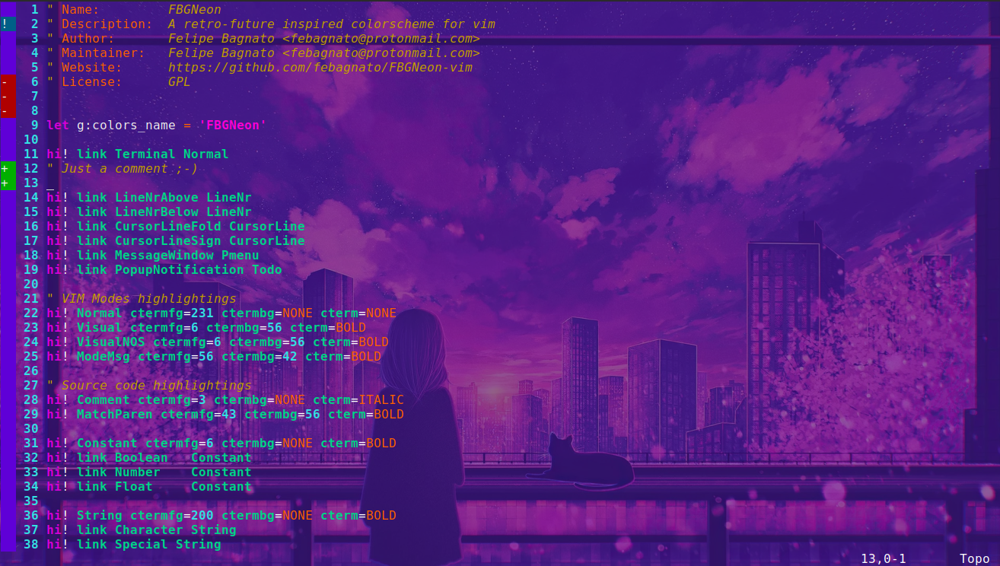

# FBGNeon-vim

## Installation
You can install FBGNeon manually by:
  1. Copying the **"colors"** to your **.vim/colors** folder
  2. Add the line `colorscheme FBGNeon` to your **.vimrc** file

## Screenshots

